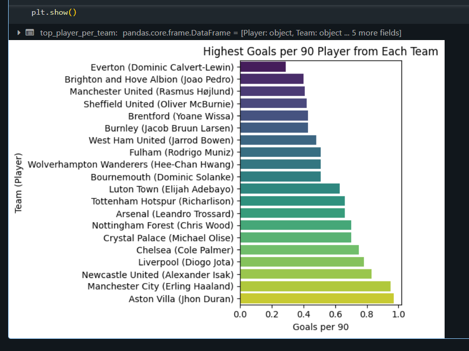
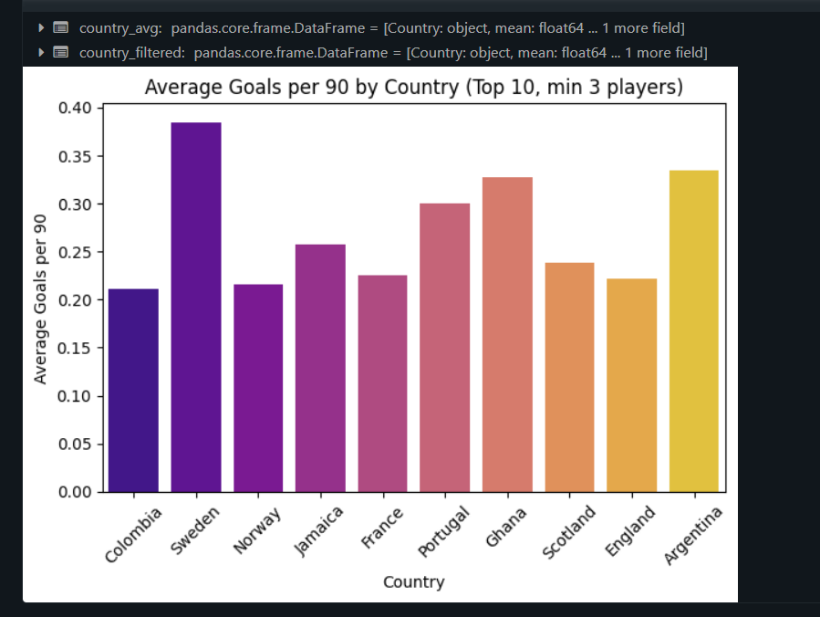
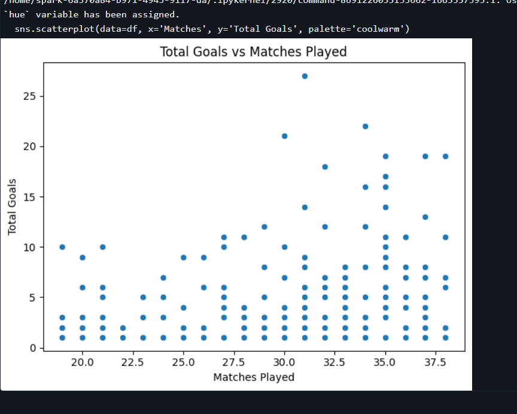
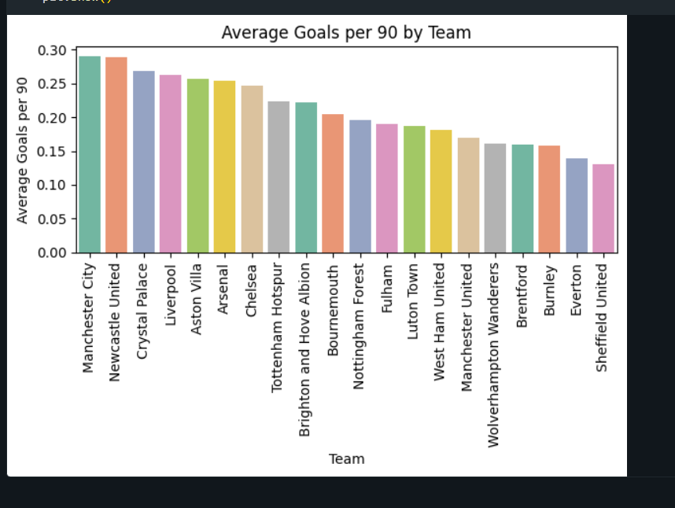
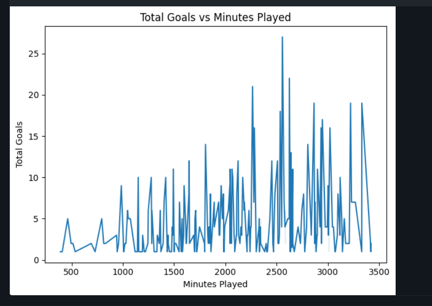
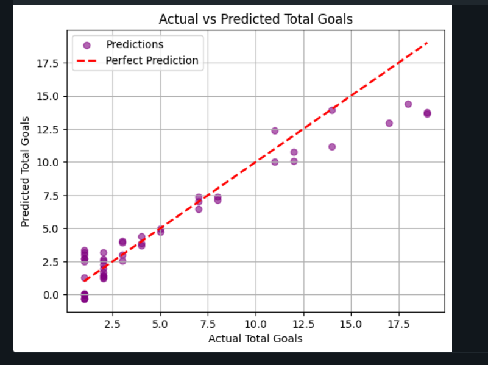

# Hackathon - Premier League Goals Dataset

### Dataset Source

- Dataset: https://www.kaggle.com/datasets/whisperingkahuna/premier-league-2324-team-and-player-insights

### Questions

1. Which players have the highest Goals per 90 across different teams?
2. Do certain countries produce players with higher scoring rates?
3. How does total goals vary by number of matches played?
4. Which teams have the highest average Goals per 90 across their players?

### Hypothesis

1. Players with more minutes played tend to have lower goals due to fatigue.

2. Players from top-performing teams have higher Goals per 90 on average than those from lower-ranked teams.

### Summary of cleaning process

1. Removed redundant rank column
2. Changed Total Goals datatype to int as it was a float datatype but all values were integers
3. Changed all country values to their full name as it was hard tell to tell what country it was.

### Summary of Results 

1. Question 1 
  
  - Grouped 'Goals by 90' by 'Team'
  - Extracted top player from the Team
  - Displayed in Barplot 
  - Can see which players have the highest goals per 90 for each team. Aston villa = Jhon Duran, Manchester United = Rasmus Hojlund, Crystal Palace = Michael Olise.
2. Question 2
  
  - Grouped 'Goals per 90' by 'Country'
  - Filtered by top 10 countries and must have a minimum of 3 players for valid results 
  - Displayed in a Barplot
  - Can see which countries produce the best scoring rates. Sweden produced the best scoring rates.
3. Question 3
  
  - Compared Total Goals vs Matches
  - Displayed in a scatter plot
  - More matches played generally results in most total goals. 30 - 32.5 matches = most total goals. 
4. Question 4
  
  - Grouped 'Goals by 90' by 'Team'
  - Displayed in Barplot
  - Manhester City & Newcastle United = highest scoring rate
5. Hypothesis 1
  
  - Tested
  - True to a certain degree
  - Minutes Played and Total Goals increase gradually until 2500 
  - Drops off after 2500 possibly due to fatigue
6. Hypothesis 2
  
  - Tested
  - True
  - Top 8 Teams with the highest Goals per 90 = 7 of them finished in the top 7
  - Outlier = Crystal Palace, who finished 10th but 3rd in goals per 90

### Summary of Predictions
  
  - Prediction of Total Goals based on minutes
 - Red dashed line = represents perfect prediction ,where the predicted value exactly matches the actual value,. The closer the points are to this line, the better the model's performance.
 - Purple dots = models predictions
 - Many points are close to the red line, especially in the lower goal ranges ,0 to 10 goals, suggesting the model is fairly accurate for players with fewer total goals.
  - For higher goal scorers ,10 to 18 goals, predictions start to deviate more from the line - the model tends to underpredict top performers slightly.

